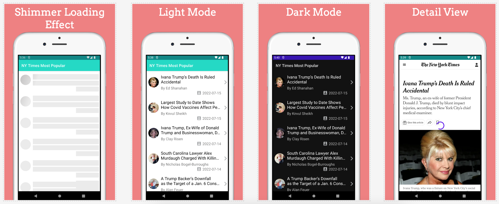
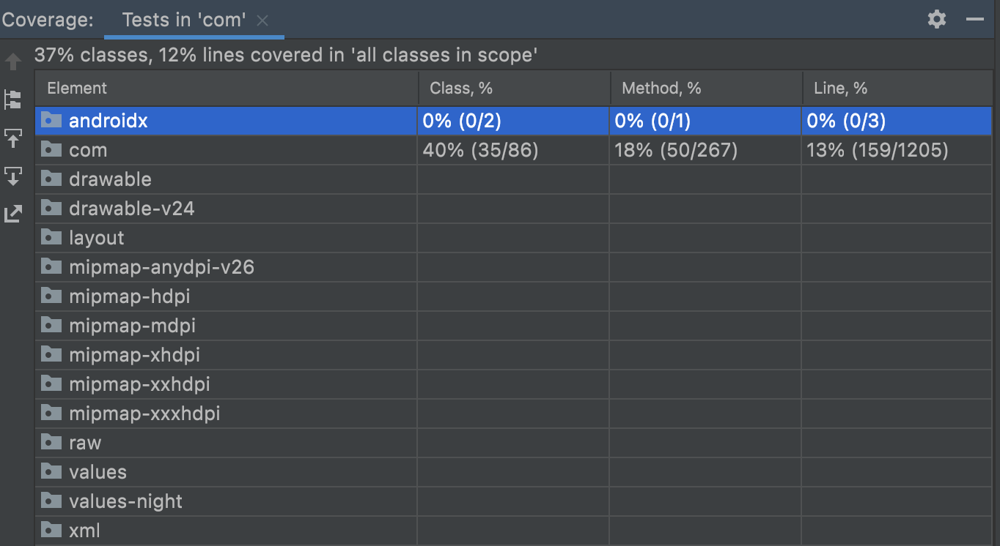

# _TakeHome Exercise_
This repo is meant for test purpose only. Its a take home exercise for an online hiring process.

### _Tech Stack of the Project_
- _Kotlin:_ As development language
- _MVVM:_ For architecture.
- _Coroutines:_ As Off main thread processing and async operations
- _mockk:_ For mocking in unit testing
- _JUnit:_ As a unit testing framework
- _Koin:_ As a Dependency Injection Framework
- _Retrofit:_ For network http calls
- _DataBinding:_ For view binding

## _Assumptions_
- Dark Theme support is as per system. Change system mode to Dark, and App will adopt to Dark mode.
- Pull to refresh for latest data.
- For scalability, no dimens were created, I used a SDP and SSP libraries for screen sizes bootstraping.
- after clicking on an item, it will be redirected to a webview where the article will be loaded.
- for simplicity hard coded 7 days period will be used for calling popular articles API.
- API keys are in a separate file for security purposes. and not pushed to Git VCS.
- screenshots are attached.

## _Built With_
- Kotlin Version: 1.6.21
- Gradle Version: 7.3.3

## _Screenshots_

## _Code Coverage_

